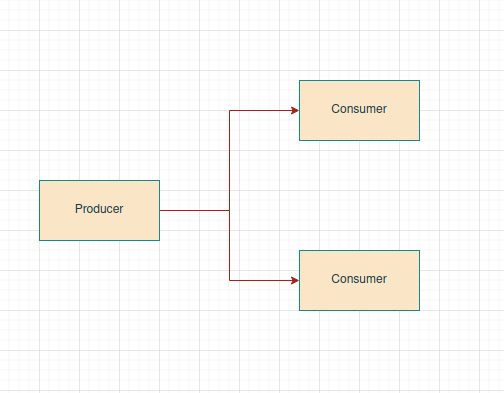

# Redis

## PubSub Use Cases

Only implement in your project Redis PubSub if is requirements which all instanes of consumer receive same once messages posted by producer. If no, you will finded scenario unpleasant.

